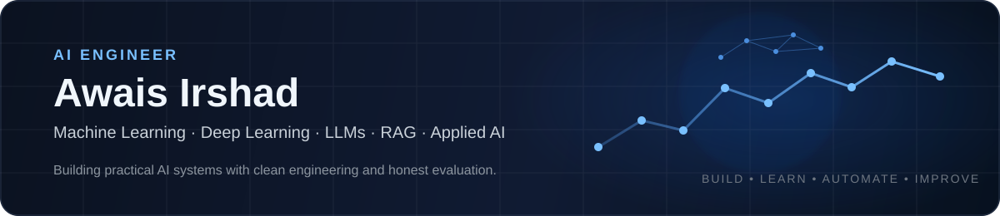
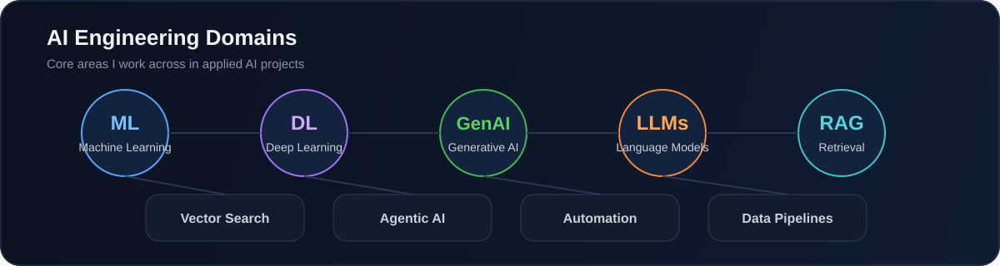
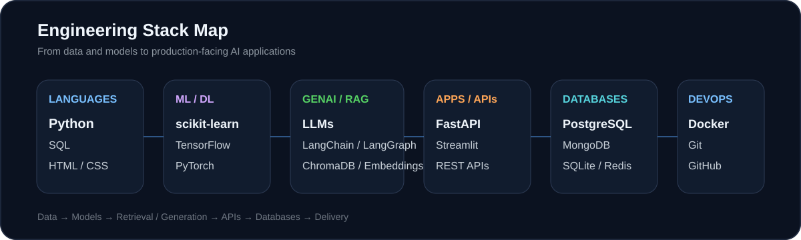

  

  <b>AI Engineer building practical, reliable AI systems.</b> 
  Machine Learning · Deep Learning · Generative AI · LLMs · RAG · Data Pipelines · Automation

  <a href="https://www.linkedin.com/in/awaisirshad41"><b>LinkedIn</b></a>

## Featured Projects

<table>
<tr>
<td width="50%" valign="top">

### 📄 [InsightDoc-RAG](https://github.com/awais41/InsightDoc-RAG)
RAG-based document Q&A with semantic retrieval and source-aware answers.

`Python` `Sentence Transformers` `ChromaDB` `LLMs` `Streamlit`

</td>
<td width="50%" valign="top">

### 📊 [LedgerIQ-AI](https://github.com/awais41/LedgerIQ-AI)
Financial intelligence for transaction analysis, anomaly detection, forecasting, and AI-assisted summaries.

`Python` `Pandas` `scikit-learn` `Isolation Forest` `Streamlit`

</td>
</tr>
<tr>
<td width="50%" valign="top">

### 🛒 [Ecommerce-Price-Intelligence](https://github.com/awais41/Ecommerce-Price-Intelligence)
Price tracking and ML pipeline with scraping, historical analysis, prediction, and dashboarding.

`Python` `Selenium` `SQLite` `Random Forest` `Pytest`

</td>
<td width="50%" valign="top">

### 🧠 [Portfolio](https://github.com/awais41/Portfolio)
Selected applied AI, ML, data, and automation projects in one portfolio repository.

`AI Projects` `ML` `RAG` `Data` `Automation`

</td>
</tr>
<tr>
<td width="50%" valign="top">

### 💻 [Code-Alpha](https://github.com/awais41/Code-Alpha)
Django e-commerce internship project covering authentication, cart, checkout, and admin workflows.

`Python` `Django` `SQLite` `HTML` `CSS`

</td>
<td width="50%" valign="top">

### 🧪 [Full_Stack_Ai_Awais](https://github.com/awais41/Full_Stack_Ai_Awais)
Python practice and foundational development work from my AI engineering learning path.

`Python` `Programming` `Practice` `Foundations`

</td>
</tr>
</table>

## AI Engineering Domains

  

## Engineering Stack

  

## Languages, Frameworks & Databases

  

  <code>Machine Learning</code> · <code>Deep Learning</code> · <code>Generative AI</code> · <code>LLMs</code> · <code>RAG</code> · <code>LangChain</code> · <code>LangGraph</code> 
  <code>ChromaDB</code> · <code>Vector Search</code> · <code>Embeddings</code> · <code>Streamlit</code> · <code>Pandas</code> · <code>NumPy</code> · <code>Pytest</code>

## What I Focus On

Applied AI systems that combine **models, data, retrieval, APIs, databases, and automation** into usable products — with maintainable code, realistic evaluation, and clear documentation.

  <b>Open to Junior AI Engineer, Applied AI, and Machine Learning opportunities.</b>

